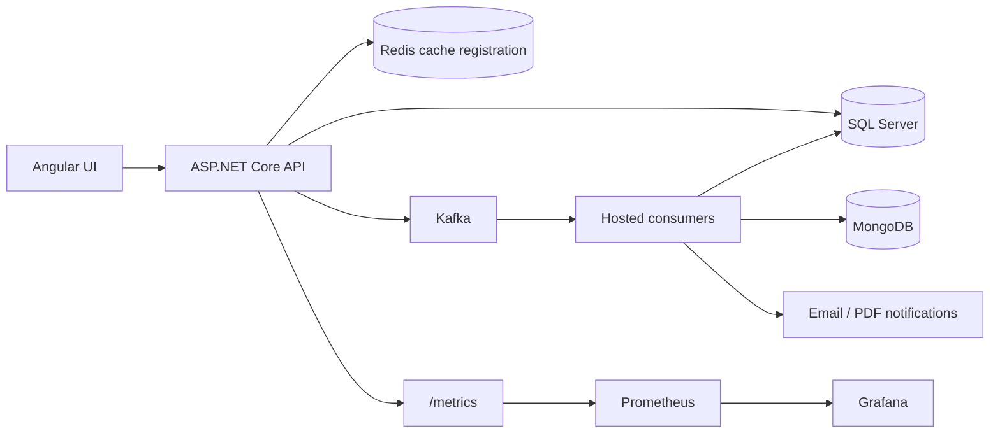

# Credit Calculator & Application Management

**A full-stack internship project built with ASP.NET Core 8 and Angular 20.**

Loan repayment calculations, customer and credit applications, asynchronous risk evaluation, and application monitoring in one repository.

[ Türkçe ](README.tr.md) · [Local setup](docs/SETUP.md) · [Backend](CreditCalculatorApi) · [Frontend](Frontend) · [Monitoring](monitoring)

## Project background

I developed this project during my software engineering internship at **VakıfBank, July–September 2025**. It was my first ASP.NET Core project and an opportunity to apply what I was learning to a banking-related workflow, from API design and persistence to an Angular interface and background processing.

The project received positive feedback from the engineers and supervisors in my department. This repository documents that learning experience and the implementation I built during the internship.

**Scope:** an educational portfolio project. The calculations and decision rules demonstrate application workflows; they do not represent VakıfBank's lending policies or a production banking service.

## What the application does

| Area | Implemented functionality |
| --- | --- |
| Loan calculations | Calculate monthly installments, total repayment, and an amortization schedule; save calculation results and filter reports. |
| Accounts | Registration, JWT-based sign-in, email confirmation, password reset, and profile management. |
| Banks and campaigns | Browse banks and filter campaigns by bank or credit type; manage banks and campaigns through the admin interface. |
| Applications | Submit customer and credit applications, view application history and approved credits, and update application statuses. |
| Risk and decisions | Process credit application events through Kafka, calculate a simplified risk classification, and map it to approval, rejection, or manual review. |
| Notifications and documents | Send application/status emails and generate PDF documents with DinkToPdf; the frontend also includes jsPDF-based exports. |
| Logging and monitoring | Process application logs through Kafka into SQL Server and MongoDB; expose Prometheus metrics and provide Grafana dashboards and alert definitions. |

## Technology stack

| Layer | Technologies |
| --- | --- |
| API | C#, ASP.NET Core 8, Swagger / OpenAPI, FluentValidation |
| Frontend | Angular 20, TypeScript, Bootstrap 5, RxJS |
| Persistence | SQL Server, Entity Framework Core 9, MongoDB |
| Messaging and caching | Apache Kafka, Confluent.Kafka, Redis |
| Authentication and data handling | JWT, BCrypt password hashing, AES encryption implementation |
| Observability | Serilog, prometheus-net, Prometheus, Grafana, JMX exporters |
| Documents | DinkToPdf / wkhtmltox, jsPDF |
| Local infrastructure | Docker Compose |

Versions reflect the checked-in project files. The backend targets .NET 8 and references EF Core 9.

## Architecture

The backend is a single ASP.NET Core application organized into controllers, services, repositories, and background consumers. Kafka consumers run as hosted services within that application.



### Credit application lifecycle

1. The API saves a credit application to SQL Server and publishes `creditapp.created`.
2. `RiskEvaluationConsumer` calculates a simplified installment-to-income ratio and risk label, then publishes `risk.evaluated`.
3. `DecisionConsumer` applies the policy, stores the decision, updates the application status, and writes an outbox record in the same database save.
4. `OutboxPublisher` publishes pending decision events to `decision.made`.
5. `DecisionNotificationConsumer` sends the status notification and records the notification in SQL Server.

The current policy maps **Safe → Approved**, **Risky → Declined**, and **Medium / other → ManualReview**. The risk calculation uses a simplified amount/term estimate; it is separate from the interest-bearing repayment calculator.

For a closer look, start with [CreditApplicationService](CreditCalculatorApi/Services/CreditApplicationService.cs), [RiskEvaluationConsumer](CreditCalculatorApi/BackgroundServices/RiskEvaluationConsumer.cs), [PolicyEngine](CreditCalculatorApi/Services/Decision/Policy/PolicyEngine.cs), and [OutboxPublisher](CreditCalculatorApi/BackgroundServices/OutboxPublisher.cs).

## Repository layout

```text
CreditCalculatorApi/
├── CreditCalculatorApi/
│   ├── Controllers/          HTTP endpoints
│   ├── Services/             Business logic, accounts, notifications, PDF
│   ├── Repository/           Data access abstractions and implementations
│   ├── Data/ & Migrations/   EF Core context and database migrations
│   ├── Entities/ & DTOs/     Persistence models and API contracts
│   ├── Validators/           Request validation
│   ├── BackgroundServices/   Kafka consumers and outbox publisher
│   ├── Messaging/ & Events/  Kafka configuration and event contracts
│   ├── Monitoring/          Application metric definitions
│   └── docker/              Local infrastructure Compose file
├── Frontend/                 Angular user and admin interfaces
├── monitoring/               Prometheus, Grafana, dashboards, alerts
└── docs/SETUP.md              Configuration and local run instructions
```

## Run locally

The application needs SQL Server, Kafka, MongoDB, Redis, and email configuration. The existing setup also loads a Windows native PDF library and contains machine-specific Docker paths.

Follow the **[local setup guide](docs/SETUP.md)** for prerequisites, configuration keys, database migrations, infrastructure startup, and application commands.

| Component | Local address |
| --- | --- |
| Angular frontend | `http://localhost:4200` |
| API / Swagger, HTTPS launch profile | `https://localhost:7152/swagger` |
| API metrics | `https://localhost:7152/metrics` |
| Prometheus, when started | `http://localhost:9090` |
| Grafana, when started | `http://localhost:3000` |

### Example calculation request

```http
POST /api/credits/hesapla-ve-kaydet
Content-Type: application/json

{
  "krediTutari": 100000,
  "vade": 12,
  "faizOrani": 3
}
```

`vade` is the term in months; `faizOrani` is the **monthly percentage rate** (`3` means 3% per month). The response includes `monthlyPayment`, `totalPayment`, and an `installments` array with payment, interest, principal, and remaining principal values. This endpoint also persists the calculation.

The implemented validator accepts amounts from 1,000 to 10,000,000, terms from 1 to 240 months, and monthly rates from 0.01% to 100%. These are application validation rules. The formula does not add bank-specific fees, taxes, or insurance.

## What I learned

- Building an ASP.NET Core API with dependency injection, DTOs, validation, and database migrations.
- Connecting an Angular application to authenticated endpoints and separating user/admin views.
- Following a business process across Kafka events, consumers, database updates, and an outbox.
- Combining relational persistence with MongoDB read models and Redis cache configuration.
- Instrumenting application behavior with logs, metrics, dashboards, and alerts.

## Project status

This repository preserves an early learning project. Further work would include automated integration tests, portable configuration, stronger secret management and log redaction, and more robust retry/idempotency handling across the event flow. Use synthetic data when exploring the application locally.

## Author

**Emirhan Efe Gözpınar**  
Software Engineering Intern at VakıfBank · July–September 2025  
[GitHub profile](https://github.com/emirhngzpnr)

